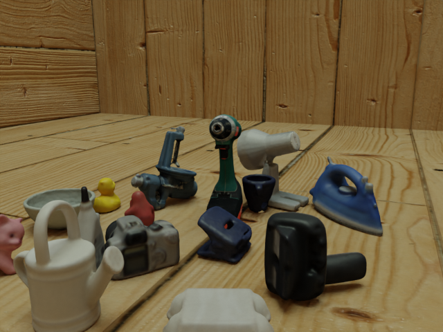
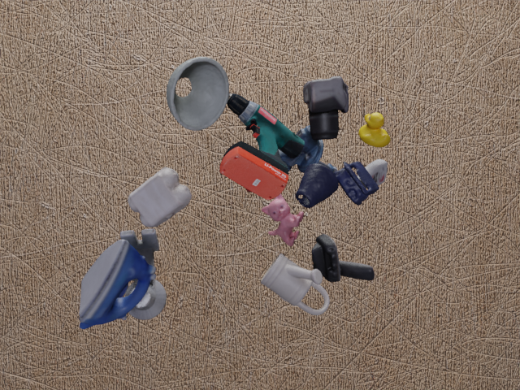
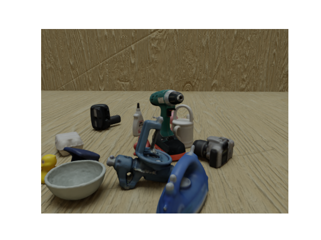
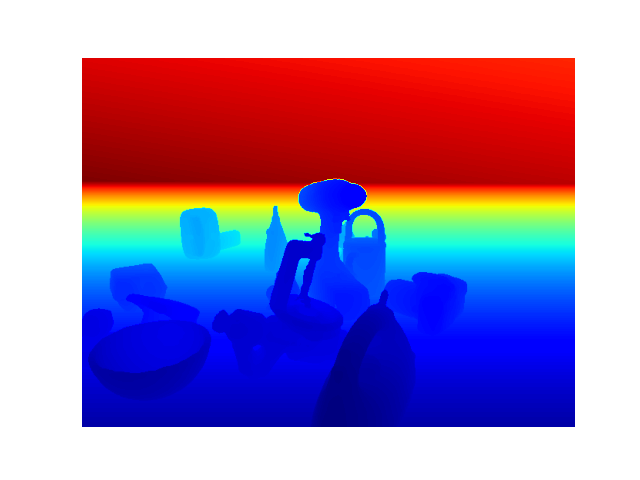
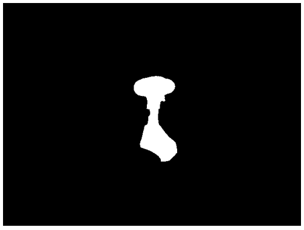

Training a neural network requires a large amount of data. The chosen algorithm, called FFB6D, uses RGB, depth and mask images as input data. Creating these images using a camera and setup is a very time-consuming and intensive process. Therefore, it was chosen to generate the data using an open-source software called BlenderProc. BlenderProc is a modular procedural pipeline for generating real looking images (photorealistic) for the training of (convolutional) neural networks. BlenderProc is programmable in Python and built on the open-source rendering software Blender. On top of this, the BOP toolkit is being used to extend BlendeRProc to have more functionality. 

FFB6D needs RGB and depth images for training along with mask images. It is possible to generate these via BlenderProc. However, the scene created is also important. Since the goal is to use the neural network in a Humen-Robot Collaboration setup the scenes are rendered in a specific form. The camera is stationary in the scenes and the objects change position. In this process, a type of room is recreated where the objects are on the floor of the room. However, other data is also provided for training so that the neural network can use a sufficient variety of scenes as training data. 
A total of three BlenderProc scipts were created: 
1. Script with 4 different views in a boxed space with stationary camera and moving objects + a Graphical User Interface (GUI) implementation [Most important script ] 
2. Script with objects in a boxed space with a moving camera and moving objects 
3. Script with "*flying*" objects and a stationary camera 

Examples: script 1 (view 3) - script 2 - script 3

  

# Table of contents 
1. Installation of BlenderProc and BOP toolkit 
2. Implementation custom object
3. Usage of BlenderProc
4. Scripts + Graphical User Interface

# Installation of BlenderProc and BOP toolkit
Installation tutorial:

## Quickstart
It is possible to test the installation by using BlenderProc's Quickstart. 

## Setup
Organize the dataset with object model (.obj or .ply files) in the following way. 

# Implementation custom object

# Usage of BlenderProc
BlenderProc should generate RGB, depth and mask images as output data along with ground-truth annotations. The main functions are briefly discussed below for more information about BlenderProc see their [github](https://github.com/DLR-RM/BlenderProc) or [documentation website](https://dlr-rm.github.io/BlenderProc/). 

 

 

# Scripts + Graphical User Interface

## Script 1

## Script 2

## Script 3
