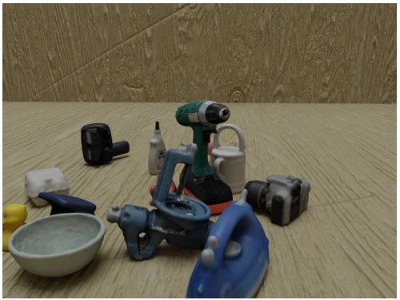

Training a neural network requires a large amount of data. The chosen algorithm, called FFB6D, uses RGB, depth and mask images as training data. Generating real life images using a camera is a very time-consuming and intensive process. Therefore, it was chosen to generate synthetic data using open-source software, one of these sotware packages is called BlenderProc. BlenderProc is a modular procedural pipeline for generating photorealistic images. These images can be applied for training neural networks. BlenderProc is programmable in Python and built on the open-source rendering software Blender. Furthermore, the BOP toolkit is  used to extend BlenderProc's functionality. For more information and an installation guide, refer to the [BlenderProc github](https://github.com/DLR-RM/BlenderProc).

As mentioned FFB6D needs RGB, depth and mask images for training. It is possible to generate these using BlenderProc. Therefore, some scenes are programmed containing different objetcs. Since the goal is to use the neural network in a Human-Robot Collaboration setup the scenes are rendered in a specific layout: the camera is stationary and the objects change position. In this way, an environment is recreated where the objects are on the floor of the room. However, other camera positions are also considered to provide the neural network with varying input data.
A total of three BlenderProc scipts were created: 
1. Script for rendering 4 different camera views in a cuboid space with stationary camera and moving objects + a Graphical User Interface (GUI) [Most important script ] 
2. Script for rendering objects in a cuboid space with a moving camera and objects 
3. Script for rendering objects projected on a simple texture background with a stationary camera 

Examples: script 1 (view 3) - script 2 - script 3

  

# Table of contents 
1. Installation of BlenderProc and BOP toolkit 
2. Implementation custom object
3. Usage of BlenderProc
4. Scripts + Graphical User Interface

# Installation of BlenderProc and BOP toolkit
The BlenderProc github already provides a decent tutorial. However, a new one was writen to document the installation process followed in this thesis. This tutorial describes the installation preces as of 2 October 2022.

1.  Installation of Python (version 3.10 is used in the thesis). This step can be validated by entering the following line in the command prompt: “python”. The command prompt should return the version of the installed Python. 
2.  Installation of BlenderProc using pip. Therefore the following line should be entered in the command prompt: 
```
pip install blenderproc 
```
To verify that BlenderProc installed correctly it is possible to type “blenderproc” in the command prompt. This should return info about the package.

3. To verify the correct working of BlenderProc and to automatically install Blender, an example can be run. This is done by entering teh following in the command prompt.
```
blenderproc quickstart 
```
After following these steps, BlenderProc is installed, but to be able to generate datasets some additional steps are required.

4.  To install the bop_toolkit package enter the following commands:
```
git clone https://github.com/thodan/bop_toolkit
cd bop_toolkit
pip install -r requirements.txt -e .
```

5.  To add textured backgrounds to the rendered scene, an texture dataset be downloaded using BlenderProc. 
Before starting this process, make sure you have 28.6 GB of free drive space.
To download the textures enter the following command in the command prompt: 
```
blenderproc download cc_textures <Path_were_folder_should_be_created>
```
Pay attention that this command will create a folder at the specified path. Therefore the folder should be named in the path already, without creating it beforehand.
If an invalid URL error is encountered. Therefore the download_cc_textures.py file had to be updated with an up-to-date URL, being https://ambientcg.com/api/v1/downloads_csv.

At this point BlenderProc can be used to generate datasets. Existing datasets can be imported in order to use the 3D models that they include. Step 6 describes this proces.

6. Download additional datasets from https://bop.felk.cvut.cz/datasets/. Any dataset works, furthermore it is only necessary to download the base archive and the object models. Make sure to save the downloaded data by using the correct directory structure. The correct structure is given below.<br>
DATASET_NAME<br>
├─ models[_MODELTYPE][_eval]<br>
&nbsp;&nbsp;&nbsp;&nbsp;─models_info.json<br>
&nbsp;&nbsp;&nbsp;&nbsp;─ obj_OBJ_ID.ply

## Setup
Organize the dataset with object model (.obj or .ply files) in the following way. 

# Implementation custom object

# Usage of BlenderProc
BlenderProc should generate RGB, depth and mask images as output data along with ground-truth annotations. The main functions are briefly discussed below for more information about BlenderProc see their [github](https://github.com/DLR-RM/BlenderProc) or [documentation website](https://dlr-rm.github.io/BlenderProc/). 

 

 

# Scripts + Graphical User Interface

## Script 1

## Script 2

## Script 3
