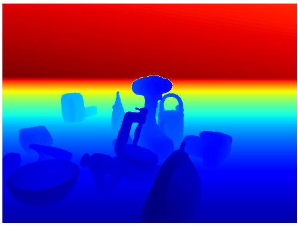
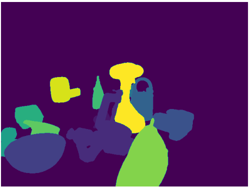

Training a neural network requires a large amount of data. The chosen algorithm, called FFB6D, uses RGB, depth and mask images as training data. Generating real life images using a camera is a very time-consuming and intensive process. Therefore, it was chosen to generate synthetic data using open-source software, one of these sotware packages is called BlenderProc. BlenderProc is a modular procedural pipeline for generating photorealistic images. These images can be applied for training neural networks. BlenderProc is programmable in Python and built on the open-source rendering software Blender. Furthermore, the BOP toolkit is  used to extend BlenderProc's functionality. For more information and an installation guide, refer to the [BlenderProc github](https://github.com/DLR-RM/BlenderProc).

As mentioned FFB6D needs RGB, depth and mask images for training. It is possible to generate these using BlenderProc. Therefore, some scenes are programmed containing different objetcs. Since the goal is to use the neural network in a Human-Robot Collaboration setup the scenes are rendered in a specific layout: the camera is stationary and the objects change position. In this way, an environment is recreated where the objects are on the floor of the room. However, other camera positions are also considered to provide the neural network with varying input data.
A total of three BlenderProc scipts were created: 
1. Script for rendering 4 different camera views in a cuboid space with stationary camera and moving objects + a Graphical User Interface (GUI) [Most important script ] 
2. Script for rendering objects in a cuboid space with a moving camera and objects 
3. Script for rendering objects projected on a simple texture background with a stationary camera 

Examples: script 1 (view 3) - script 2 - script 3

  

# Table of contents 
1. Installation of BlenderProc and BOP toolkit 
2. Implementation custom object
3. Usage of BlenderProc
4. Scripts + Graphical User Interface

# Installation of BlenderProc and BOP toolkit
The BlenderProc github already provides a decent tutorial. However, a new one was writen to document the installation in this thesis.

## Quickstart
It is possible to test the installation by using BlenderProc's Quickstart. 

## Setup
Organize the dataset with object model (.obj or .ply files) in the following way. 

# Implementation custom object

# Usage of BlenderProc
BlenderProc should generate RGB, depth and mask images as output data along with ground-truth annotations. The main functions are briefly discussed below for more information about BlenderProc see their [github](https://github.com/DLR-RM/BlenderProc) or [documentation website](https://dlr-rm.github.io/BlenderProc/). 

 

 

# Scripts + Graphical User Interface

## Script 1

## Script 2

## Script 3
