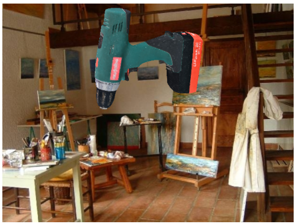
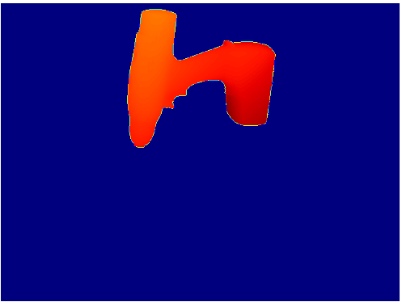
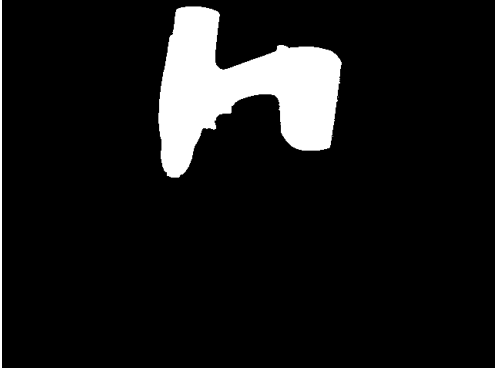
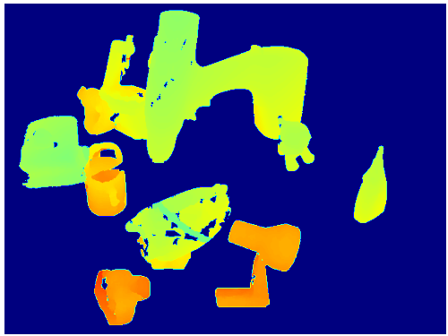
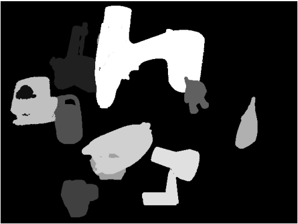
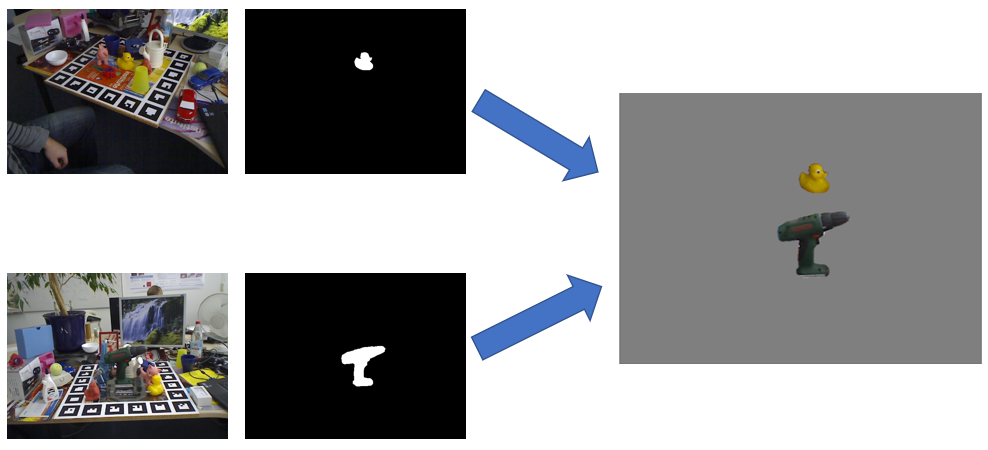

[RasterTriangle](https://github.com/ethnhe/raster_triangle) is a non-photorealtic rendering software created by the creators of FFB6D. It is a simple renderer for synthesis data with as input a mesh and poses, and as output the rendered RGB image, depth image, mask image and annotations. Each set of images (RGB, depth and mask) along with their annotation are stored in a *.pkl* file. RasterTriangle can create two types of data named *Rendered* and *Fused*. 

# Table of contents 
1. Installation of RasterTriangle 
2. Rendered data
3. Fused data
4. Change to RasterTriangle

# Installation of RasterTriangle
First install FFB6D. To install Raster Triangle execute the following commands in the root of FFB6D:
```
git clone raster triangle --> git clone https://github.com/ethnhe/raster_triangle.git
```
and then run to compile the source code:
```
cd raster_triangle
chmod +x ./rastertriangle_so.sh
./rastertriangle_so.sh
```
The last step is setup RasterTriangle with the datasets. 
* To link RasterTriangle with a dataset (for example the LineMod dataset). This can be done with a symbolic link:
  ```
  ln -s path_to_dataset_root ./<dataset_name>
  ```
* Download the SUN2012pascalformat dataset via this [link](http://groups.csail.mit.edu/vision/SUN/releases/SUN2012pascalformat.tar.gz) 
  Unzip this and link the dataset to the RasterTriangle root via:
  ```
  ln -s path_to_SUN2012pascalformat ./
  ```
* Download the sample poses from the [OneDrive](https://hkustconnect-my.sharepoint.com/personal/yhebk_connect_ust_hk/_layouts/15/onedrive.aspx?id=%2Fpersonal%2Fyhebk%5Fconnect%5Fust%5Fhk%2FDocuments%2Fpublically%20shared%20%E5%85%B1%E4%BA%AB%E6%96%87%E4%BB%B6%E5%A4%B9%2FLineMOD%5Fsyn%5Fsample%5Fpose&ga=1) and move the pickle files to folder ``` sampled_poses/ ``` .
# Rendered data

**Note:** the poses are saved per object in a pkl file. This contains 70,000 poses and this for each object separately. This means that it is possible to generate the same images each time but the number is also limited to the amount in the .pkl-files.
<p align="center">
    
</p>

# Fused data
<p align="center">
    
</p>

# Change to RasterTriangle
The main changes are made for generating  fused data. For the thesis, the input for making the fused data was changed. Previously, the fused data was created based on real data from the LineMod dataset. Now this is changed to the rendered data form RasterTriangle itself. This implies that Rendered data should first be generated for every object (that should be included in the fused data). Afterwards this rendered data will be used to generate the fused data for the object of interest.

The figure below shows an example of the creation of the fused data. The input data fot this example is the LineMod dataset. 
<p align="center">
  
</p>
