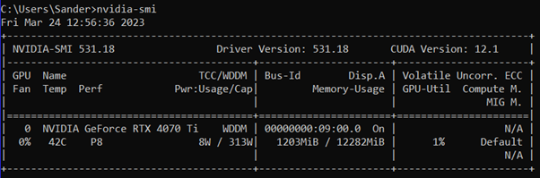
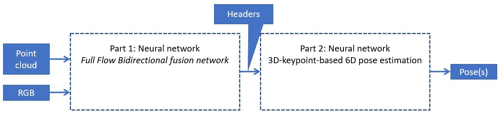
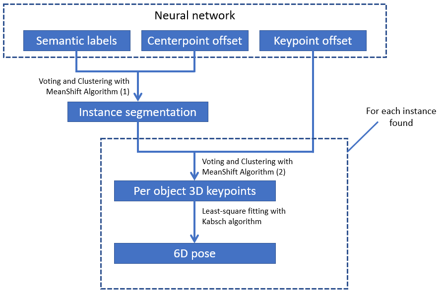
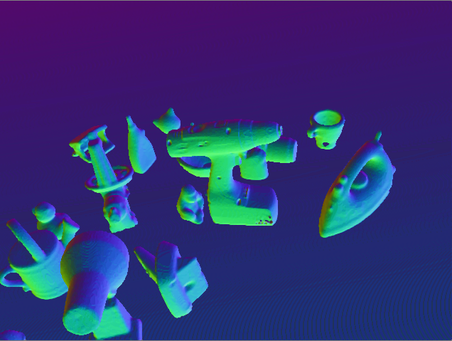

After a literature study around 6D object pose estimation algorithms and challenges of these in Huamn-Robot Collaboration, an algorithm called [FFB6D](https://github.com/ethnhe/FFB6D). FFB6D stands for "**F**ull **F**low **B**idirectional Fusion Network for **6D** Pose Estimation". At the representation learning stage of FFB6D, bidirectional fusion modules are build in the full flow of the two networks. Here fusion is applied to each encoding and decoding layer. This makes it possible that the two networks can exchange information between each other. FFB6D works on the basis of estimating the position of pre-selected keypoints. A simple 3D keypoints selection algorithm considering the texture and geometry information of objects comes along with FFB6D, which simplifies keypoint localization for the pose estimation.

# Table of contents 
1. Installation of FFB6D
2. Usage
3. Implementation of Custom object
4. Training & Results

# Installation of FFB6D 
This section will explain how to install FFB6D and all necessary dependencies. The operating system used is Linux Ubuntu version 22.04. The reason for this tutorial is that we found that the github page of [FFB6D](https://github.com/ethnhe/FFB6D) did not explain the installation process thoroughly enough for people with less experience with Ubuntu, CUDA, etc.

 ## 1. Installation Anaconda
The first step consists of installing anaconda. Anaconda was used to simplify the management of installed packages. The installation process described below is based on this [tutorial](https://www.digitalocean.com/community/tutorials/how-to-install-anaconda-on-ubuntu-18-04-quickstart).

To install anaconda, execute the following commands in the terminal:
```
sudo apt install curl
cd /tmp
curl -O https://repo.anaconda.com/archive/Anaconda3-2022.10-Linux-x86_64.sh
bash Anaconda3-2022.10-Linux-x86_64.sh
```
When asked to run ‘conda init’ enter ‘yes’ into the terminal window. Afterwards, reopen the terminal. Anaconda should now be installed.

 ## 2. Creating environment
This step creates the environment in which python and future packages will be installed. It was found that Python version 3.7.13 was compatible with all the packages to be installed. Execute the following command to create the environment, which we called 'ffb6d'.
```
conda create --name ffb6d -c anaconda python=3.7.13
```
To activate the environment, execute the following command:
```
conda activate ffb6d
```
Make sure that when installing future packages, the activated environment is FFB6D.

 ## 3. Create working directory
For convenience, a new folder was created in the home directory of Ubuntu. This folder was named FFB6D and will be the working directory for the remainder of the installation process. When executing a git clone command, make sure that the active directory is FFB6D.

 ## 4. Installation of CUDA 
FFB6D makes use of the CUDA tools and libraries, therefore the used system needs to be equipped with a NVIDIA graphics card. Before starting the installation of CUDA, it should be checked which version of CUDA your system supports. This can be done by entering ``` nvidia-smi ``` in the terminal. This should yield an output that looks like the figure below. 

<p align="center">
  
</p>

It is suggested to install the latest drivers before continuing the installation process. The latest drivers can be downloaded from https://www.nvidia.com/download/index.aspx.

If running this command results in an error, please verify if the NVIDIA drivers are installed correctly. The NVIDIA drivers can be installed through the software manager in Ubuntu.

In the top right corner of the output, the CUDA version is displayed. For this project CUDA 11.8 was used, which is lower than what the GPU supports. This is not a problem due to CUDA’s backwards compatibility.

To install CUDA, it was chosen to install through a runfile. This way the installer has a graphical UI, which makes the process easier to understand. Execute the following commands ([reference](https://developer.nvidia.com/cuda-11-8-0-download-archive?target_os=Linux&target_arch=x86_64&Distribution=Ubuntu&target_version=22.04&target_type=runfile_local)) to install CUDA:
```
wget https://developer.download.nvidia.com/compute/cuda/11.8.0/local_installers/cuda_11.8.0_520.61.05_linux.run
sudo sh cuda_11.8.0_520.61.05_linux.run
```
Make sure to remove the checkbox for the GPU drivers in case any other version of the GPU drivers were already installed.

After the installation is finished, it is suggested in the output of the installer to add a couple of directories to PATH and LD_LIBRARY_PATH. Execute following commands to do so:
```
export PATH="/usr/local/cuda-11.8/bin:$PATH"
export LD_LIBRARY_PATH=/usr/local/cuda-11.8/lib64
```
This concludes the installation of CUDA.

 ## 5. Installation of PyTorch 
The next step is to install PyTorch, this is a library commonly used for applications such as computer vision. It is recommended to use the easy-to-use user interface of the PyTorch website (https://pytorch.org/get-started/locally/) to determine which command must be executed based on the used OS, and package manager. The executed command for the Linux OS using pip at the time being was as follows, see the figure below. 

# Usage

 



 

# Implementation of Custom object

## Dataset arrangement/organization 

# Training & Results
