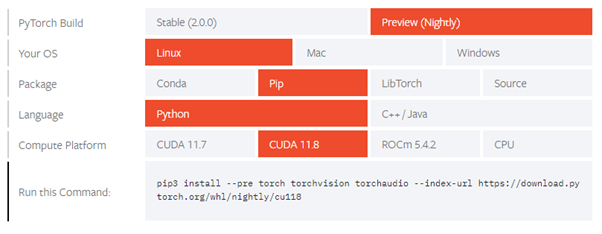

After a literature study around 6D object pose estimation algorithms and challenges of these in Huamn-Robot Collaboration, an algorithm called [FFB6D](https://github.com/ethnhe/FFB6D). FFB6D stands for "**F**ull **F**low **B**idirectional Fusion Network for **6D** Pose Estimation". At the representation learning stage of FFB6D, bidirectional fusion modules are build in the full flow of the two networks. Here fusion is applied to each encoding and decoding layer. This makes it possible that the two networks can exchange information between each other. FFB6D works on the basis of estimating the position of pre-selected keypoints. A simple 3D keypoints selection algorithm considering the texture and geometry information of objects comes along with FFB6D, which simplifies keypoint localization for the pose estimation.

# Table of contents 
1. Installation of FFB6D
2. Overview

# Installation of FFB6D 
This section will explain how to install FFB6D and all necessary dependencies. The operating system used is Linux Ubuntu version 22.04. The reason for this tutorial is that we found that the github page of [FFB6D](https://github.com/ethnhe/FFB6D) did not explain the installation process thoroughly enough for people with less experience with Ubuntu, CUDA, etc.

 ## 1. Installation Anaconda
The first step consists of installing anaconda. Anaconda was used to simplify the management of installed packages. The installation process described below is based on this [tutorial](https://www.digitalocean.com/community/tutorials/how-to-install-anaconda-on-ubuntu-18-04-quickstart).

To install anaconda, execute the following commands in the terminal:
```
sudo apt install curl
cd /tmp
curl -O https://repo.anaconda.com/archive/Anaconda3-2022.10-Linux-x86_64.sh
bash Anaconda3-2022.10-Linux-x86_64.sh
```
When asked to run ‘conda init’ enter ‘yes’ into the terminal window. Afterwards, reopen the terminal. Anaconda should now be installed.

 ## 2. Creating environment
This step creates the environment in which python and future packages will be installed. It was found that Python version 3.7.13 was compatible with all the packages to be installed. Execute the following command to create the environment, which we called 'ffb6d'.
```
conda create --name ffb6d -c anaconda python=3.7.13
```
To activate the environment, execute the following command:
```
conda activate ffb6d
```
Make sure that when installing future packages, the activated environment is FFB6D.

 ## 3. Create working directory
For convenience, a new folder was created in the home directory of Ubuntu. This folder was named FFB6D and will be the working directory for the remainder of the installation process. When executing a git clone command, make sure that the active directory is FFB6D.

 ## 4. Installation of CUDA 
FFB6D makes use of the CUDA tools and libraries, therefore the used system needs to be equipped with a NVIDIA graphics card. Before starting the installation of CUDA, it should be checked which version of CUDA your system supports. This can be done by entering ``` nvidia-smi ``` in the terminal. This should yield an output that looks like the figure below. 

<p align="center">
  
</p>

It is suggested to install the latest drivers before continuing the installation process. The latest drivers can be downloaded from https://www.nvidia.com/download/index.aspx.

If running this command results in an error, please verify if the NVIDIA drivers are installed correctly. The NVIDIA drivers can be installed through the software manager in Ubuntu.

In the top right corner of the output, the CUDA version is displayed. For this project CUDA 11.8 was used, which is lower than what the GPU supports. This is not a problem due to CUDA’s backwards compatibility.

To install CUDA, it was chosen to install through a runfile. This way the installer has a graphical UI, which makes the process easier to understand. Execute the following commands ([reference](https://developer.nvidia.com/cuda-11-8-0-download-archive?target_os=Linux&target_arch=x86_64&Distribution=Ubuntu&target_version=22.04&target_type=runfile_local)) to install CUDA:
```
wget https://developer.download.nvidia.com/compute/cuda/11.8.0/local_installers/cuda_11.8.0_520.61.05_linux.run
sudo sh cuda_11.8.0_520.61.05_linux.run
```
Make sure to remove the checkbox for the GPU drivers in case any other version of the GPU drivers were already installed.

After the installation is finished, it is suggested in the output of the installer to add a couple of directories to PATH and LD_LIBRARY_PATH. Execute following commands to do so:
```
export PATH="/usr/local/cuda-11.8/bin:$PATH"
export LD_LIBRARY_PATH=/usr/local/cuda-11.8/lib64
```
This concludes the installation of CUDA.

<p align="center">
  
</p>

 ## 5. Installation of PyTorch 
The next step is to install PyTorch, this is a library commonly used for applications such as computer vision. It is recommended to use the easy-to-use user interface of the PyTorch website (https://pytorch.org/get-started/locally/) to determine which command must be executed based on the used OS, and package manager. The executed command for the Linux OS using pip at the time being was as follows, see the figure below. 

<p align="center">
  
</p>

 ## 6. Installation of Additional packages 
This part of the installation will install most of the needed libraries required to run FFB6D. Execute following commands to install these packages:
```
git clone https://github.com/ethnhe/FFB6D.git
pip install cython
pip install scikit-image
pip3 install -r requirement.txt
 ```
Please note that in order to execute the last command, one should change the activate directory in the terminal to the folder in which the requirement.txt file is located. Furthermore, an updated requirement file is added because the included file with FFB6D is not complete and contained package versions which were not compatible with anaconda.

 ## 7. Installation of NVIDIA Apex 
This step will explain how to install NVIDIA Apex. [Apex](https://github.com/NVIDIA/apex) contains utilities to streamline mixed precision and distributed training in Pytorch.

Apex will be built from source; it is recommended to install the ‘ninja build’ tool to speed up this process. Ninja can be installed by executing ``` sudo apt-get install ninja-build ```.

Execute following commands to build the Apex package:
```
git clone https://github.com/NVIDIA/apex
cd apex
export TORCH_CUDA_ARCH_LIST="6.1;7.5;8.9;9.0"
pip install -v --disable-pip-version-check --no-cache-dir --global-option="--cpp_ext" --global-option="--cuda_ext" ./
```

Please note that the values in the TORCH_CUDA_ARCH_LIST variable represent the compute complexity that Apex must be built for. The compute complexity depends on what generation of NVIDIA GPU is used. To see what versions are supported by your GPU please refer to https://en.wikipedia.org/wiki/CUDA.

The installation process should conclude by the terminal printing the following text: "Successfully installed apex-0.1".

 ## 8. Installation of NormalSpeed
This step will explain how to install [NormalSpeed](https://github.com/hfutcgncas/normalSpeed). NormalSpeed is a fast algorithm for computing the normal of a depth image. 

To install normalSpeed some pre-required packages should be installed, namely opencv and pybind11.

  ### 8.1 Installation of OpenCV
The only working installation method for OpenCV that did not result in problems installing NormalSpeed was to install opencv from source. This process will be described below.

Firstly, make a new directory called test_opencv in the root of FFB6D. This will be the working directory to build OpenCV from source. Next, download and unzip OpenCV by executing the following commands:
```
wget https://github.com/opencv/opencv/archive/refs/tags/3.4.16.tar.gz 
tar -xvf 3.4.16.tar.gz 
```

Make sure to now remove the original 3.4.16.tar.gz file, as the next download has the same name. Next download and unzip OpenCV_contrib by executing the following commands:
```
wget https://github.com/opencv/opencv_contrib/archive/refs/tags/3.4.16.tar.gz
tar -xvf 3.4.16.tar.gz
```
Next, execute the following commands to build OpenCV.
```
cd opencv-3.4.16
mkdir build
cd build
cmake -D CMAKE_BUILD_TYPE=Release -D CMAKE_INSTALL_PREFIX=/usr/local .. -DPYTHON_INCLUDE_DIR=$(python3 -c "import sysconfig; print(sysconfig.get_path('include'))")  \ -DPYTHON_LIBRARY=$(python3 -c "import sysconfig; print(sysconfig.get_config_var('LIBDIR'))")
cmake -D CMAKE_BUILD_TYPE=Release -D CMAKE_INSTALL_PREFIX=/usr/local -D OPENCV_EXTRA_MODULES_PATH=../../opencv_contrib-3.4.16/modules/ ..
make -j16 (Note: 16 = amount of logical processors, this depends on the CPU used)
sudo make install
```
  ### 8.2 Installation of NormalSpeed
With OpenCV now installed, the NormalSpeed package can be installed. Execute following commands in the root of FFB6D:
```
pip3 install "pybind11[global]"
git clone https://github.com/hfutcgncas/normalSpeed.git
cd normalSpeed/normalSpeed
python3 setup.py install –user
```
python3 setup.py install –user NormalSpeed should now be installed.

 ## 9. Installation of Tkinter
Tkinter is a Python library, which is used to create graphical user interfaces (GUIs). This package will be used to visualise the images and the predicted pose resulting from the neural network. To install Tkinter enter following command in the terminal:
```
sudo apt install python3-tk
```

 ## 10. Compilation of RandLA-Net operators
To compile the RandLa-Net operators, first the directory to the Python site-packages (PYTHONPATH) should be exported. In our case the Python site packages were in the following directory: /home/user/anaconda3/envs/ffb6d/lib/python3.7/site-packages/

To export the PYTHONPATH enter the following command:
```
export PYTHONPATH="/home/user/anaconda3/envs/ffb6d/lib/python3.7/site-packages/
```
Next, change the active directory to the RandLA-directory by entering: ``` cd ffb6d/models/RandLA/ ```
Next enter the following command to compile the RandLa operators: ``` sh compile_op.sh ```

Should entering the last command result in errors, it is suggested to try the following fixes:
* Uninstalling enum34: ``` pip uninstall enum34 ```
* Remove --home=”.” from line 2 in the compile_op.sh file
* Installing specific version of setuptools: ``` pip install setuptools==58.2.0 ```

The ``` sh compile_op.sh ``` command should run successfully now.

 ## 11. Installation Raster Triangle
See RasterTriangle folder

 ## 12. Installation of pretrained models
On the GitHub page regarding FFB6D, pretrained models for the neural network are made available. A download link for the zip file is given on GitHub. This zip-file will contain a pretrained model for each of the 13 models which are used in the preprocessed LineMod dataset. The individual pretrained models should be saved to the following directory: ``` ~/FFB6D/ffb6d/train_log/linemod/<Name of object> ```. 
 
# Overview
The workflow of FFB6D can be divided into two major parts. The first part is the neural network, more specifically, the Full Flow Bidirectional Fusion Network. This neural network is responsible for processing the input to result in RGB and point cloud features. These features are then fed into the second part of the workflow, namely the 3D-keypoint-based 6D pose estimation. The RGB and point cloud features from the neural network are processed with unsupervised machine learning techniques to extract different objects (instance segmentation) and their 6D pose. The two parts are connected by using three headers. The figure below shows the overall structure of FFB6D and thus also for this chapter. The various components of FFB6D are reviewed further in this chapter. First, the neural network is discussed in detail, followed by an explanation of the communication bridges between the 2 subnetworks, which make this network bidirectional. Afterwards, the output of the neural network is discussed, focussed on the three headers. Finally, 3D keypoint extraction is discussed. 

<p align="center">
  
</p>

The predicted semantic label and centre point offset of each point in the scene are combined. These are then, for each predicted object in the scene, clustered with a MeanShift clustering algorithm. This clustering algorithm is used to distinguish different object instances. Afterwards, for each instance, each point within the 3D keypoints offset header votes for its target 3D keypoint using the MeanShift algorithm. Finally, a least-squares fitting algorithm is applied to recover the object pose parameters according to the detected 3D keypoints.

<p align="center">
 
</p>
