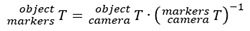
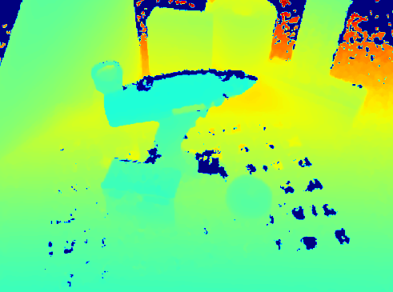

To test the trained model on a real environment, a data set was created. Several scenes were recorded with an RGB(D) camera (Realsense L515). These scenes were then processed to extract ground truth information. Two different methods are proposed. 

The RGB(D) camera saves an RGB and depth image. After camera calibration, these images can be processed into ground truth information. The first method works on the basis of Aruco markers and an ICP algorithm. This mehode requires a number of steps. The second method works only on the basis of the ICP algorithm. 
The main libraries/packages used are [OpenCV](https://opencv.org/) and [Open3D](http://www.open3d.org/). OpenCV is mainly used for the calibration and detection of the Aruco markers. Whereas Open3D is used for the ICP algorithm. 

The ICP algorithm used follows from the 6DPoseAnnotator Github page: https://github.com/sakizuki/6DPoseAnnotator. This 6D pose annotator package uses Open3D and allows the user to manually annotate poses by projecting a point cloud onto the RGB image. This point cloud is based on a given CAD model of the object of interest. The pose is then refined using ICP on the depth image.

# Table of contents 
1. RGB(D) camera
2. First method
3. Second method
4. Code explanation 
5. Result

# RGB(D) camera
For generating the new dataset, three different RGBD cameras were tried, namely the RealSense L515 and D435, as well as the Azure Kinect DK. After using these cameras it was determined that the Azure Kinect DK resulted in the best depth images, followed by the L515. However, it was found that the ease of use of the software for the Azure Kinect camera is poor compared to the RealSense cameras. It should be noted that the use of the python package Open3D simplified the use of the Kinect camera marginally. The Kinect was the last camera that was tried, due to time constraints, the real dataset will only include images taken with the L515. 

# First method
Using OpenCV, it is possible to determine the pose of a marker board relative to the camera. Different marker types can be used such as: ArUco, AprilTags and QR codes.

The first workflow uses the markers and the ICP algorithm. This involves placing the object on a wooden plate that has ArUco markers applied to it. The used ArUco board is a 6x9 board, where the markers are 5 cm in size. The idea of the first workflow is that once the relative pose of the object of interest with respect to the marker board is determined, the camera can be moved freely. To determine the pose of the object for a new camera position, only the new pose of the marker board with respect to the camera should be determined because the pose between the board and the object is known.

1. The transformation of the origin of the marker board with respect to the camera has to be determined. OpenCV is used to determine the pose of the markerboard with respect to the camera. Therefore, OpenCV defines a new coordinate system, of which the origin lies in the marker with id 0. 

2. The pose of the object with respect to the camera should be determined. The 6D pose annotator will be used to determine this pose.

3. At this point the transformation matrix that describes the pose of the markers with respect to the camera is known, as well as the transformation matrix for the pose of the object relative to the camera. From these matrices the pose of the object relative to the markerboard can be determined.

 

4. Now the camera can be moved freely. The transformation of the object relative to the marker board changes is determined and does not change anymore. By using the calculated transformation matrix, the only matrix that has to be determined for new camera perspectives is the matrix that relates the markers to the camera. Therefore, all images can now be processed using OpenCV. If enough markers are visualized, OpenCV is able to correctly determine the axes of the board. The marker with ID 0 does not necessarily have to be visible when there are enough markers visible with a different ID. If there are too few markers in view, it is not possible to determine the pose of the object with the marker board. For each new image the ground truth pose of the object can be determined by applying formula: 

 

5. The final step consists of applying the ICP algorithm to eliminate further errors/deviations. The input of the algorithm is the pose of the objects as was determined earlier. 

 

# Second method
The second workflow only uses the ICP algorithm. For this workflow, the object and/or camera may move relative to each other. This workflow is to be applied to a video where the object or camera is moved. For the first frame, the object's pose relative to the camera is determined using ICP. The input pose for the next frame is then set equal to the pose of the object in the previous frame. For each frame, the pose is refined by applying the ICP algorithm.

In this approach the RGB information is used only to annotate the first frame. For the next frames only the respective depth image is used to apply the ICP algorithm. It should be noted that the difference in pose between two successive images should not be too great as the algorithm uses the previous image as a starting point. The reason is that only points (of the point cloud of the scene) are considered that are within a certain distance threshold from the point cloud of the projected object. This projected object initially has the pose of the previous scene. This distance threshold is iteratively reduced to refine the pose. However, it cannot be set too large to avoid incorrect poses. When the relative distance between two successive scenes is small, the algorithm can easily find the object. The speed at which the object is allowed to move relative to the camera depends on the camera’s frame rate. However, with fast moving objects there can be a second problem, namely motion blur. This can partially be solved by increasing the frame rate. However, this also depends on the type of shutter. A rolling shutter is more sensitive to motion blur than a global shutter.
The following image shows an example of an annotated frame using this method.

 

# Code explanation 
As mentioned above, processing can be done in two different ways. 
The first way is based on possibly given initial transformations or on a default setting. 
The user must apply the ICP algorithm with keys on the keyboard. Each image must be checked/processed individually. 
In the second way, the algorithm can do this automatically. The user still has to manually set the translation in the 
first image and then the ICP algorithm proceeds. The refinement of the ICP algorithm is done automatically. 
In this method, the pose of the object should not differ too much between 2 consecutive images (in other words a video is best). 
In addition, the user can still process the images himself. 

The controls for both methods are the same. 

ICP algorithm: 
* 'a': coarse ICP - 10.0 * voxel_size
* 'z': medium ICP - 5.0 * voxel_size
* 'e': fine  ICP  - 2.0 * voxel_size
* 'r': very fine  - 1.0 * voxel_size

Settings:
* 'n': next image 
* 'p': previous
* 'c': Changing the rotation steps from coarse to fine or vice versa & the translation steps from negative to positive or vice versa 

Rotation:
* '1' and '4': rotation roll axis
* '2' and '5': rotation pitch axis
* '3' and '6': ratation yaw axis

Translation:
* '7': translation x axis  
* '8': translation y axis  
* '9': translation z axis  

In addition, here are two methods for creating mask images. The first method is by projecting the 3D model onto a binary image. 
This does not take occlusions into account. The second method works the same way but does so in a depth image and 
reads in the actual depth image. When the distance between the two depth images is less than a certain threshold the object is visible.  

# Result
Two real datasets were recorded and annotated. The two real datasets are:
Dataset 1: static images of the driller and distractor objects (occluded + non-occluded scenes), annotated using method 1
Dataset 2: movie where the driller is moved across the field of view, annotated using method 2
The images below give some more examples of the scenes included in these datasets (RGB with prjected ground truth mask + Depth).
 
## Examples Dataset 1

  

 

  

 

  

## Examples dataset 2

  

 

  

